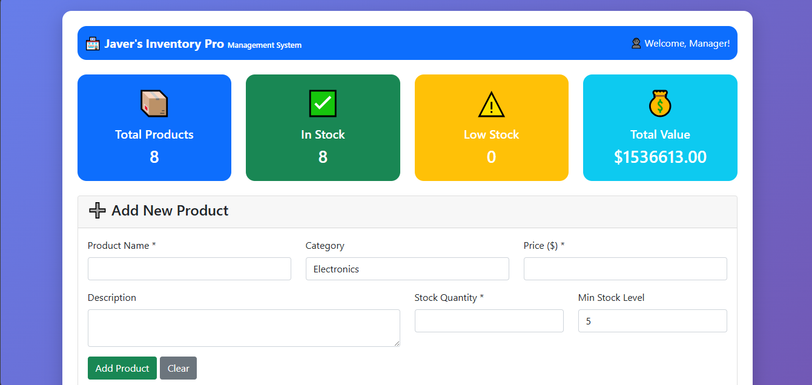
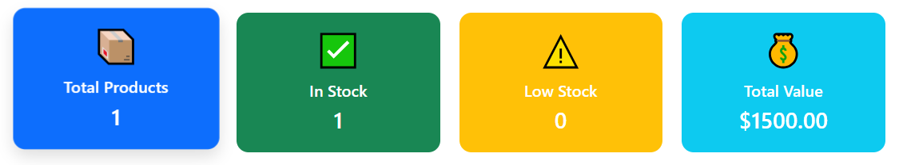
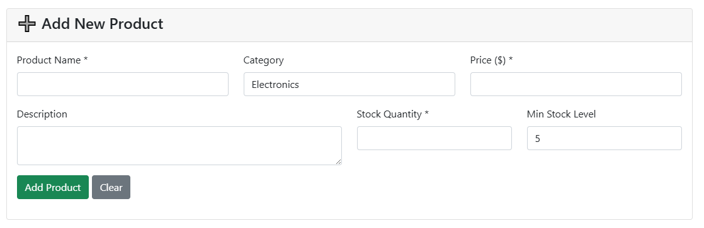
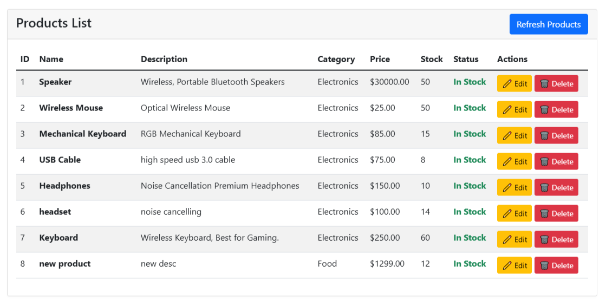
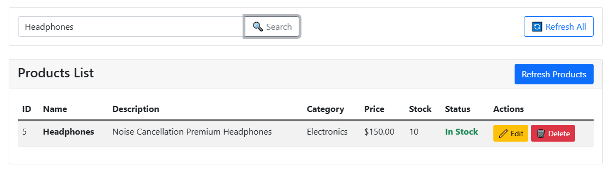

A web-based Inventory Management System for small businesses built using Node.js, Express.js, MySQL, HTML, CSS, JavaScript, and Bootstrap.
# Inventory Management System

## Overview
The Inventory Management System (IMS) is a web-based application designed to help small and medium-sized businesses efficiently manage inventory, suppliers, and stock levels.

## Features
- Product Management
- Inventory Tracking
- Supplier Management
- Search Functionality
- Dashboard Analytics

## Technology Stack
### Frontend
- HTML5
- CSS3
- JavaScript
- Bootstrap

### Backend
- Node.js
- Express.js

### Database
- MySQL

## Users
- Inventory Manager
- Store Owner
- Sales Staff
  
## Database Tables

The system uses the following tables:

- products
- suppliers
- stock_transactions
  
## Screenshots

### Complete System Interface


### Dashboard Overview
Displays inventory statistics including total products, products in stock, low-stock items, and total inventory value.



### Add New Product
Form for adding products with category, price, stock quantity, and minimum stock level.



### Product Management
View, edit, and delete products from the inventory database.



### Product Search
Search products by name and view filtered inventory results.



## Learning Outcomes

- Database Design using MySQL
- CRUD Operations
- RESTful API Development
- Backend Development with Node.js and Express.js
- Frontend Integration
- Inventory Tracking and Management

## Installation

1. Clone repository

```bash
git clone <repository-url>
